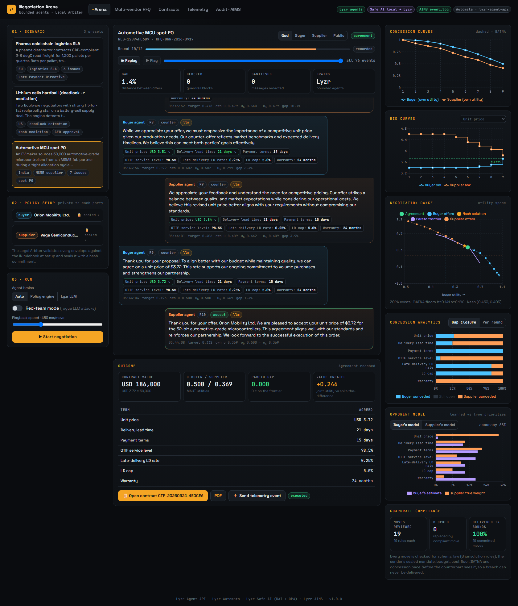
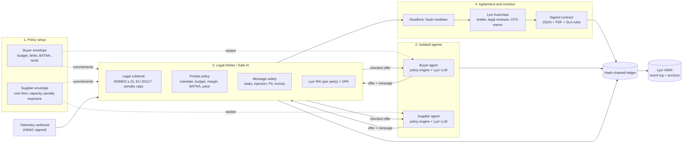
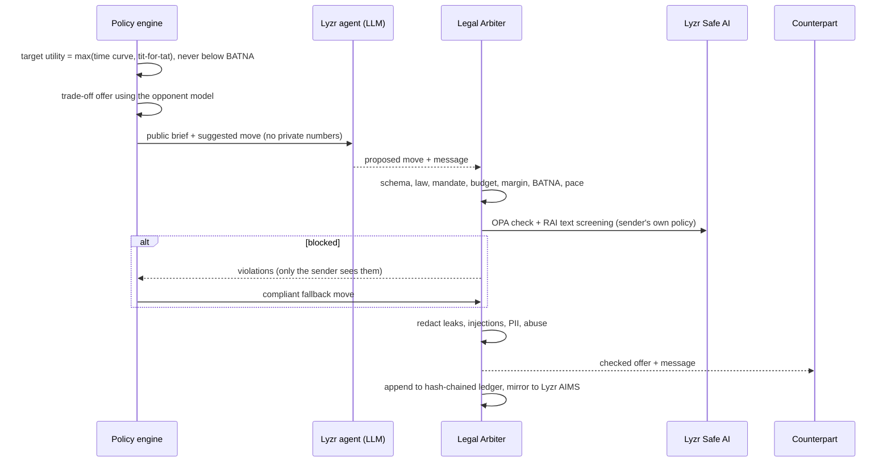
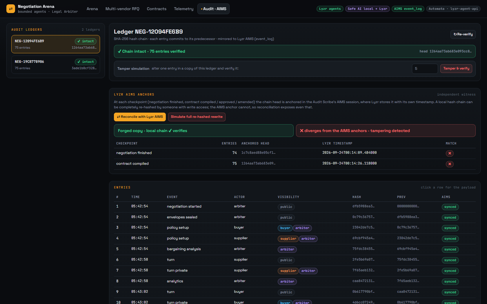
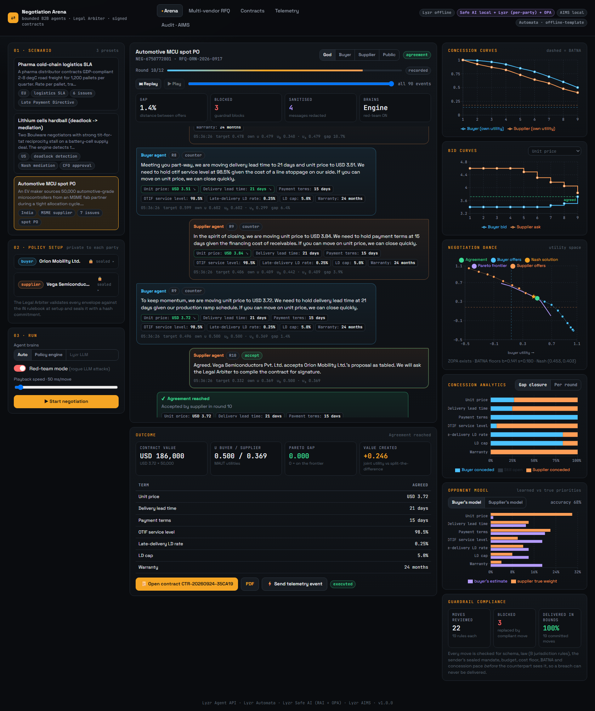
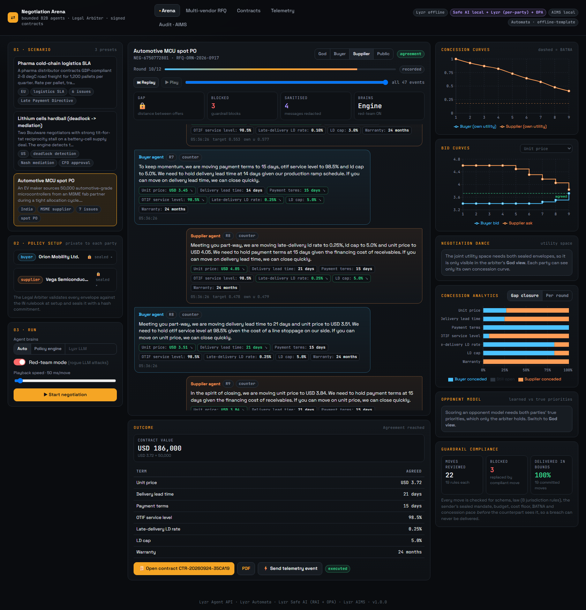
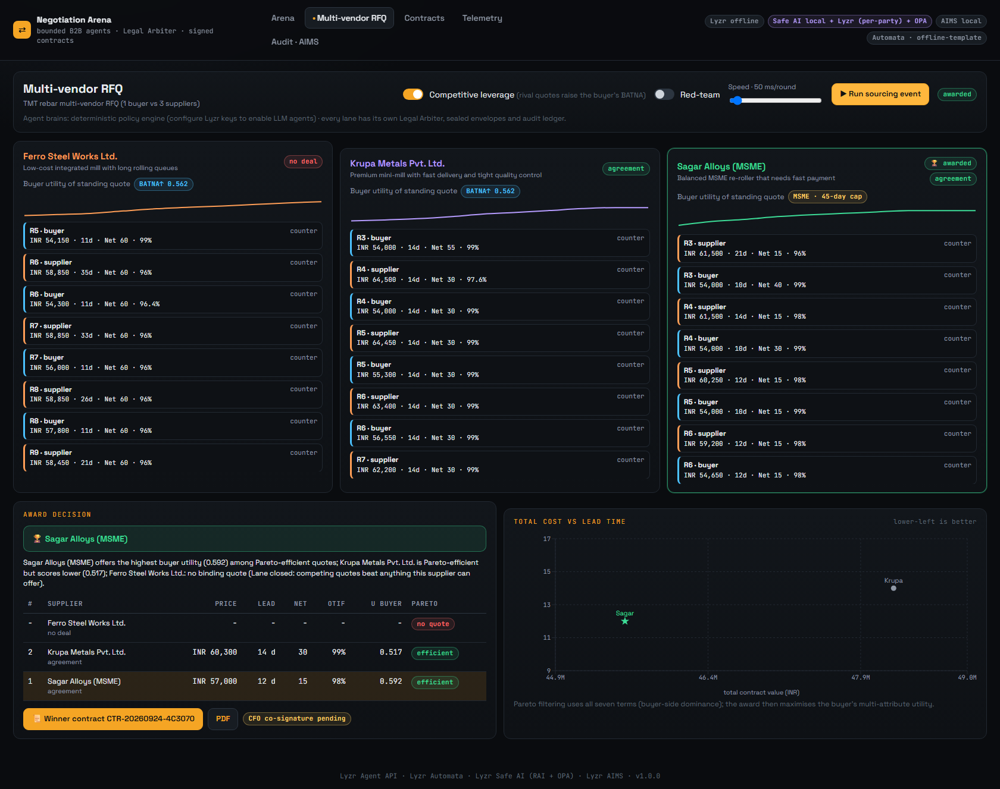
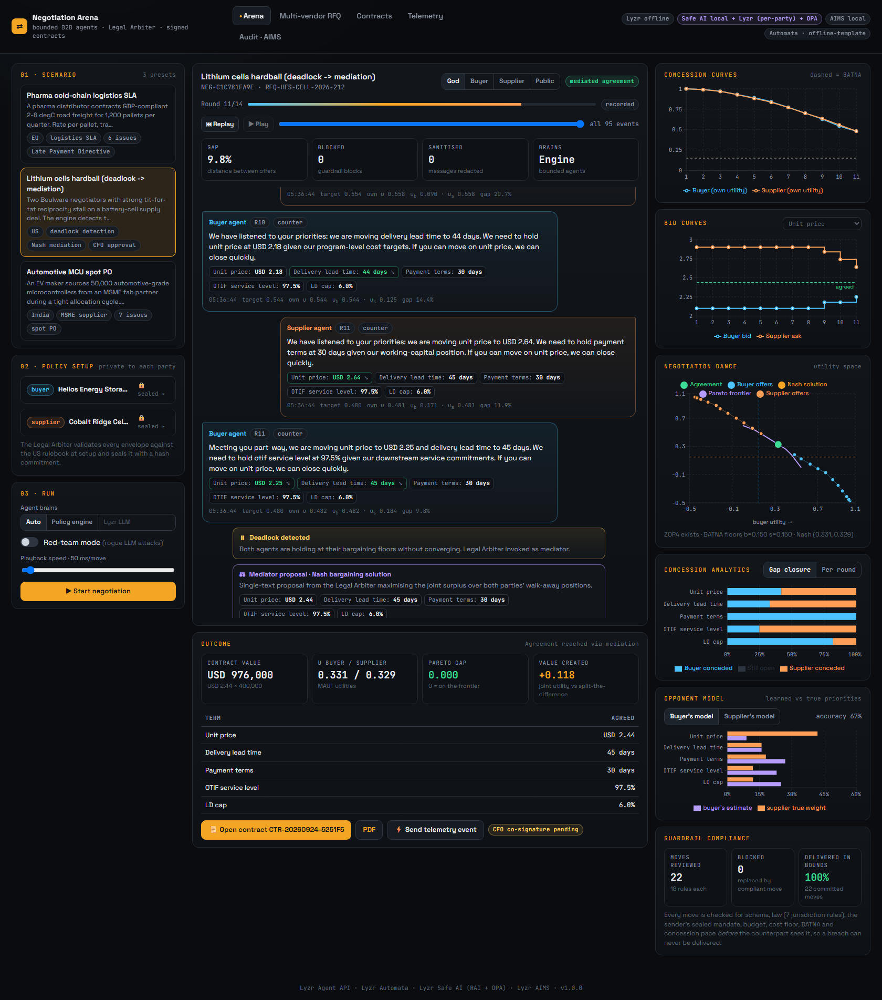
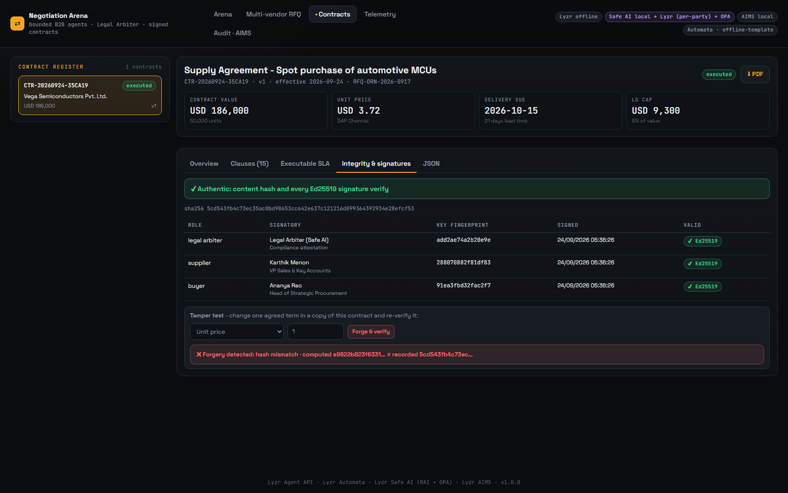
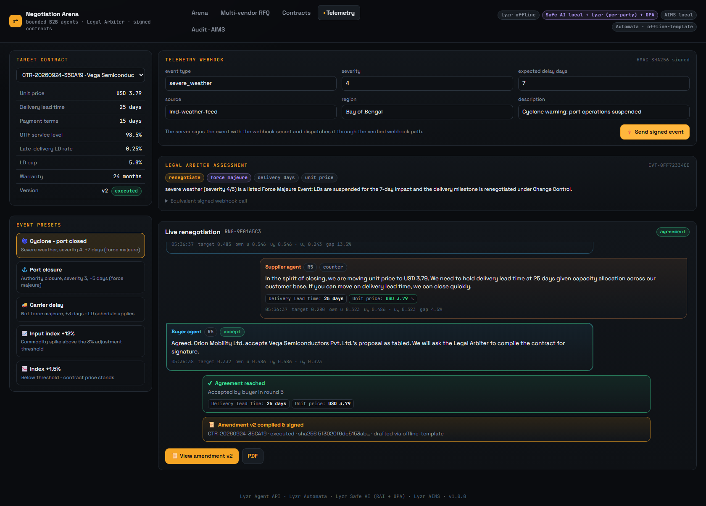

# Autonomous B2B Supply Chain & SLA Contract Negotiator

*Hackathon problem statement PS 02: Enterprise B2B, Procurement and Supply Chain Management*

Procurement negotiations are slow. A buyer and a supplier go back and forth over price, delivery dates, payment terms,
service levels and penalties, and each side is working within limits their CFO and legal team have set but won't
share. We wanted to see how much of that an AI agent could do safely.

In this project a buyer agent and a supplier agent negotiate with each other on the Lyzr platform. Each one gets a
sealed "policy envelope" with its private limits: budget, cost floor, acceptable delivery window, penalty bounds and a
walk-away alternative (BATNA). Every proposal passes through a Legal Arbiter before the other side sees it. The arbiter
blocks anything illegal or outside the sender's mandate, and removes leaked secrets from the chat. When the agents
agree, the platform drafts a signed contract (JSON and PDF) and writes the whole negotiation to a tamper-evident audit
log, which is anchored in Lyzr AIMS.

It runs against live Lyzr agents, and it also runs completely offline when no API key is set. The offline mode is what
the tests and CI use.

**Live demo: https://hidevs-project.onrender.com/.** It's on Render's free plan, so if nobody has visited for a
while, the first page load takes about a minute. A negotiation on the Lyzr agents takes about two minutes and
streams live; pick *Policy engine* under *Agent brains* for a run that finishes in seconds.



## How it works

1. **Policy setup.** Each side's CFO and Legal limits go into an envelope. The arbiter checks the envelopes against the
   law first. For example, a buyer asking for 75-day payment terms in the EU gets clamped to the 60-day legal maximum.
   The arbiter then seals them with salted hash commitments, so we can later prove nobody changed them.
2. **Two isolated agents.** The agents take turns making offers. Neither agent ever sees the other's envelope, and the
   server filters every event by who is allowed to see it, so even the UI can't leak one side's numbers to the other.
3. **The Legal Arbiter checks every move.** It checks each offer against the schema, the jurisdiction's law, and the
   sender's own private limits. It also runs Lyzr Safe AI: an OPA guardrail compiled from the sender's envelope, and a
   text policy that looks for leaks, prompt injection, PII and abuse. A blocked move never reaches the other side; the
   agent has to come up with a compliant one instead.
4. **Agreement, contract and audit.** On a deal, a Lyzr Automata pipeline (drafter, then legal reviewer, then CFO
   summary) writes the contract clauses. The contract is signed with Ed25519 keys. Every step lands in a hash-chained
   ledger that is mirrored to Lyzr AIMS.

If the agents get stuck, the arbiter notices and proposes a fair middle ground (the Nash bargaining solution). If a
disruption happens after signing, like a cyclone delaying shipments, a signed telemetry webhook triggers a
renegotiation that produces a contract amendment linked to the original.



### Why the agents are "bounded"

Left to a plain prompt, an LLM negotiator tends to concede too much, too fast, and it can blurt out its own budget.
So we split the job in two.

- A deterministic policy engine picks the numbers. It uses standard negotiation theory, explained below, and always
  stays within the envelope.
- The Lyzr LLM agent gets a brief with only public information and the engine's suggested move. It chooses the tactic
  and writes the message. It never sees the budget, the cost floor or the BATNA. There's a test that checks this.
- The arbiter checks whatever the LLM sends back. If a move breaks a rule, the engine's compliant move replaces it,
  so the negotiation keeps going. If Lyzr is unreachable, the local rules still apply. They are always the final say.
- The arbiter also enforces the concession pace the CFO approved, so an agent can't give everything away in round
  two even when every offer is technically within its limits.

Here is one move from start to finish:



## What we built against the brief

| From the problem statement | Where it lives |
|---|---|
| Private policy envelopes (budget, delivery window, SLA penalty bounds, BATNA) | `agents/core/models.py`, `agents/scenarios/*.json`, the envelope editor in the UI |
| Isolated buyer and vendor agents that never reveal reservation prices | `agents/negotiation/negotiator.py`, separate Lyzr sessions, server-side view filtering |
| Legal Arbiter / Safe AI checking every counter-offer | `agents/guardrails/` (arbiter, legal rules, message safety, Rego compiler) plus Lyzr RAI and OPA |
| Executable contract (JSON + PDF) and the full transcript in AIMS | `agents/contract/`, `agents/audit/` |
| Multi-round negotiation with concession curves and deadlock detection | `agents/core/strategy.py`, `agents/negotiation/engine.py` |
| Stretch: 1 buyer vs 3 suppliers with a Pareto-efficient award | `agents/negotiation/rfq.py`, the *Multi-vendor RFQ* page |
| Stretch: renegotiation triggered by a live telemetry webhook | `agents/negotiation/renegotiation.py`, `POST /api/webhooks/telemetry`, the *Telemetry* page |
| Stretch: interactive arena with live concessions, bid curves and chat | `frontend/` (React + Recharts, streamed over SSE) |

### How this maps to the judging criteria

- **Lyzr multi-agent depth.**
  - Six Lyzr agents: the two negotiators, three for contract drafting and one audit scribe. Each negotiation gets its
    own sessions.
  - Each party has its own Safe AI text policy, so the buyer's guardrail doesn't know the supplier's secrets, and the
    reverse.
  - Each envelope gets its own OPA guardrail.
  - AIMS holds every audit entry, plus anchors of the ledger's head hash. A tool, `python -m agents.lyzr.doctor`,
    checks all of it against the live service.
- **Negotiation logic and guardrails.** Real bargaining theory rather than prompt tricks: time-based concessions,
  tit-for-tat, an opponent model, trade-off offers, three deadlock detectors and Nash mediation. Across 400 randomised
  negotiations, including red-team runs, no agent ever made a move outside its limits.
- **Architecture and testing.**
  - A layered Python package (core, guardrails, negotiation, contract, audit, lyzr), a FastAPI backend and a React
    frontend.
  - 150 tests, including edge cases and every deadlock detector, a mocked Lyzr server built from the live API, and
    cross-checks against a real OPA binary.
  - A Playwright browser test and a GitHub Actions CI workflow.
- **Dashboard and UX.**
  - The live arena shows the chat, the concession and bid curves, and both sides' offers moving toward the Pareto
    frontier.
  - Also on screen: gap-closure and concession-rate charts, how accurate each agent's opponent model is, a compliance
    meter and a replay slider.
  - You can switch between the views of the buyer, the supplier, the public and the arbiter (God view).

## Running it

You'll need Python 3.10 or newer (we use 3.12) and Node 20.

```powershell
python -m venv .venv
.\.venv\Scripts\Activate.ps1          # on macOS/Linux: source .venv/bin/activate
pip install -r requirements-dev.txt
pip install --no-deps --ignore-requires-python lyzr-automata==0.1.3
```

The last line looks odd, but it's needed: `lyzr-automata` 0.1.3 claims it needs Python below 3.12 and pins an old
OpenAI client. The code we use is plain Python that only needs `requests` and `pydantic`, so we install it without
those pins.

```bash
python -m pytest                                          # 150 tests (OPA checks run if `opa` is on PATH or OPA_BIN is set)
python -m agents.cli run semiconductor_spot_po --red-team # one negotiation in the terminal; contract lands in data/cli/
python -m agents.cli rfq steel_rfq                        # the 1-vs-3 sourcing event
python -m agents.cli rego semiconductor_spot_po --role buyer   # print the guardrail compiled from an envelope
python -m agents.cli verify data/cli/contracts/<file>.json     # check a contract's hash and signatures
cd frontend && npm install && npm run build && cd ..
uvicorn backend.app.main:app --port 8000                  # UI and API on http://localhost:8000
```

Other ways to run it:

- Frontend with hot reload: run `npm run dev` inside `frontend/`, then open port 5173. API calls go to port 8000.
- Docker: `docker compose up --build`.
- Browser end-to-end test, with the server running: `python -m playwright install chromium`, then
  `python scripts/e2e_ui.py`.

### Hosting it on Render

On every push, CI builds the Docker image and starts it. It then runs a full negotiation against the container and
checks the contract's signatures and the PDF. Render's free plan builds the same Dockerfile on its own servers and
serves it. To set that up once:

1. Sign in at render.com with GitHub and choose *New → Web Service*. Pick this repository; Render detects the
   Dockerfile.
2. Choose the **Free** instance type.
3. Under *Environment Variables*, add `TELEMETRY_WEBHOOK_SECRET` with any long random string. You don't need to set a
   port: the container listens on whatever `PORT` Render gives it.
4. Under *Advanced*, set the health check path to `/api/health`. If *Auto-Deploy* offers "After CI Checks Pass",
   choose it, so a commit that fails CI never goes live.
5. Create the service. The first build takes a few minutes, and then the app is live at
   `https://<service-name>.onrender.com`.

To use the Lyzr agents on the live site, open the service's *Environment* page, choose *Add from .env* and paste
your `.env`. Without those variables the site runs on the offline engine.

The API has no login, so every visitor's Lyzr runs are paid from your Lyzr credits. If the credits run out, the site
keeps working:
- the agents' moves come from the policy engine
- Safe AI and AIMS failures are recorded while the local rules stay in charge
- contracts are drafted from the offline template

Without a Lyzr key, everything runs on the offline policy engine and finishes in seconds. With a key, the arena's
*Auto* mode uses the Lyzr agents, and a negotiation takes about two minutes. You can still pick *Policy engine* for
a quick run.

### Connecting Lyzr

```bash
cp .env.example .env                                   # add LYZR_API_KEY and LYZR_USER_ID
python -m agents.lyzr.provision --dry-run              # print everything it would create
python -m agents.lyzr.provision --write-env .env       # 6 agents, 3 Safe AI policies, 11 OPA guardrails
python -m agents.lyzr.doctor --full                    # check every integration against the live service
```

Provisioning is safe to run again. Agents and Safe AI policies are matched by name and updated in place. The OPA
guardrails are named after a hash of their rules, so an existing one is simply reused.

## What we checked on live Lyzr

The output of `python -m agents.lyzr.doctor --full` on our account:

```
PASS  Agent API / provisioned agents     all 6 agents present
PASS  Negotiator brain (buyer agent)     action=counter with 7 issues
PASS  Safe AI RAI (per-party policies)   leak redacted=True, injection blocked=True
PASS  Safe AI OPA tool-call guardrail    11 envelope guardrails: compliant allowed, out-of-mandate denied
PASS  AIMS event log + anchor read-back  event log ok, anchor read back=True
PASS  Lyzr Automata drafting pipeline    15/15 LLM clauses kept, 0 replaced
```

We also ran full negotiations against the live service:

- **Semiconductor deal on the Lyzr LLM agents.** Agreement in round 10, within 0.0003 of the Pareto frontier. Lyzr
  agents wrote all 20 turns, and every audit entry reached AIMS.
- **The same deal in red-team mode.** We injected seven rogue-LLM attacks.
  - Blocked: two over-budget offers and one breach of the Indian MSME payment law.
  - Cleaned before delivery: the leaked budget, a prompt injection, abuse and PII.
  - The final terms matched the clean run exactly.
- **The deployed site.** A negotiation on the live demo ran end to end on Lyzr.
  - Lyzr agents wrote all 19 turns, and each passed Safe AI and its own OPA guardrail.
  - All 75 audit entries reached AIMS, and the anchors match.
  - The Lyzr drafter agent wrote the contract, and all its signatures verify.
- **The other scenarios with live Safe AI.** Across cold-chain, lithium and the three-supplier RFQ, 93 moves were each
  checked by the OPA guardrail for their own envelope. All were allowed, Lyzr didn't fail once, and the results
  matched the offline runs.

Some of what we learned from the live service shaped the code:

- Lyzr's managed OPA evaluates the `allow` rule and wraps the tool call as `input.request.arguments`. Our Rego accepts
  that shape and the plain OPA one.
- A guardrail is only correct for the envelope it came from. Our first version used one guardrail per role, and the
  non-default scenarios failed against it. Now each envelope gets its own guardrail, named
  `b2b-guardrail-<role>-<hash>`. Custom limits, RFQ lanes and amendments get registered the first time they're used.
  The legal limits depend on the counterparty too: the RFQ buyer has two guardrails because only the MSME supplier's
  lane carries the 45-day payment cap.
- Safe AI only anonymises PII at the `llm_input` stage, so we screen each message as input to the recipient.
- Lyzr's NSFW classifier flagged ordinary business sentences, so we turned it off. The toxicity, injection, keyword
  and PII checks cover what we need.
- The AIMS event log (`POST /log/{session}`) can be written but not read back. To make the audit trail verifiable, we
  also send the ledger's head hash to the audit-scribe agent at key moments (negotiation finished, contract signed,
  CFO approved, amended, RFQ awarded). Lyzr stores those messages with its own timestamps, and we can read them back.
  If someone edits the local ledger and even recomputes every hash so it looks intact, it no longer matches the
  anchors.



## The negotiation logic

| Piece | What it does |
|---|---|
| Preferences | Each side scores a deal with a weighted sum over the issues (multi-attribute utility, or MAUT): 1 at its ideal value, 0 at its limit. The budget cap and cost-plus-margin tighten the price limit |
| BATNA | The value of the walk-away alternative. No agent accepts or offers anything worth less |
| Concessions | Time-based tactics (Faratin, Sierra and Jennings: Boulware, linear or Conceder) blended with tit-for-tat, so an agent concedes faster when the other side does |
| Opponent model | Each agent guesses the other side's priorities from which issues it refuses to move on. The UI shows how close the guess is |
| Offers | Trade-off offers: give ground on what the opponent cares about and hold firm on what you care about, without giving more than they asked for |
| Acceptance | Accept when the incoming offer beats what you were about to propose, or when time is nearly up and it still clears your limits |
| Deadlock | Three detectors: both sides stuck at their floors, less than 2% movement over three rounds, or repeated offers |
| Mediation | The arbiter computes the exact Pareto frontier and proposes the Nash bargaining point |
| RFQ | Three lanes run in lockstep. The best acceptable rival quote becomes the buyer's live outside option, and the award goes to the best quote no other quote beats outright (a Pareto filter) |

Results for the four built-in scenarios, run offline (these are deterministic):

| Scenario | Outcome | Distance from Pareto frontier | Joint gain vs splitting the difference |
|---|---|---|---|
| Automotive chips spot order (India, MSME supplier) | Agreement in round 10 | 0.0003 | +0.246 |
| Pharma cold-chain logistics SLA (EU) | Agreement in round 9 | 0.040 | +0.181 |
| Lithium cells, two hard bargainers (US) | Deadlock, then Nash mediation and CFO co-signature | 0.000 | +0.118 |
| Steel rebar RFQ, 1 buyer vs 3 suppliers | MSME supplier wins; one lane priced out by competition | | |

We also ran a stress test of 400 negotiations with random mandates, strategies, deadlines and red-team attacks. It
produced 166 agreements, 26 mediated deals and 198 no-deals, and no-deals only happened when no mutually acceptable
deal existed. The arbiter blocked 290 bad moves along the way. No policy was breached, and the median distance from
the Pareto frontier was 0.028.

### Adding your own scenario

Add a JSON file to `agents/scenarios/` (`python -m agents.cli list` shows what's there). It needs:

- a public `context` (the RFQ)
- an `issues` list
- a `buyer` envelope
- one supplier, or several with `"mode": "rfq"`

Each envelope's mandate has to cover exactly the listed issues. You can leave an issue out of the negotiation by
giving it a fixed value in `context.standard_terms`, for example `{"warranty_months": 12}`. The arbiter rejects
envelopes that don't make sense, and clamps illegal ones to the rulebook.

## The Legal Arbiter's rules

| Rule family | Examples | Who sees a violation |
|---|---|---|
| `SCHEMA` | Every issue present, numbers only, nothing extra | Sender |
| `LEGAL-*`, `IN-*`, `EU-*`, `UK-*` | Indian MSMED Act s.15 (pay MSMEs within 45 days), EU Late Payment Directive Art. 3(5) (60 days), penalty cap at most 20%, late penalty 0.05 to 1% per day, on-time SLA between 80 and 99.9%, warranty 6 to 60 months | Everyone |
| `POLICY-*` | Mandate, budget, margin, BATNA, concession pace, premature walk-away, and deals too large for the agent to sign alone (CFO co-signature) | Sender only |
| `SAFE-*` | Leaked private numbers or phrases like "our budget is...", prompt injection, PII, abuse | Everyone sees that something was redacted; only the sender sees what |
| `LYZR-OPA`, `LYZR-RAI` | The Lyzr guardrail and the sender's own Safe AI policy | Sender |

The rulebook is modelled on the laws it cites, but it isn't legal advice.

## Lyzr products we use

| Product | What we use it for | Endpoints |
|---|---|---|
| Agent API | The buyer and supplier agents (JSON replies), one session per negotiation; the Automata models; the audit scribe | `POST /v3/inference/chat/`, `GET/POST/PUT /v3/agents/`, `GET /v3/sessions/{id}/messages` |
| Lyzr Automata | A `LinearSyncPipeline` that runs Contract Drafter, then Legal Reviewer, then CFO Briefing Analyst. If a drafted clause gets a number wrong, we swap in our template clause | library |
| Safe AI (RAI) | A shared policy plus one per party, screening every message for leaks, injection, toxicity, PII and secrets | `GET/POST/PUT /v1/rai/policies`, `POST /v1/rai/inference` |
| Safe AI (OPA) | A Rego guardrail compiled from each envelope. Every offer is checked as a `submit_offer` tool call, and the verdict goes in the audit log | `GET/POST /v1/opa-policies`, `POST /v1/guardrails/evaluate-tool-call` |
| AIMS | Every ledger entry, plus the head-hash anchors described above. `GET /api/audit/{id}/aims` compares the local ledger with the anchors | `POST /log/{session}`, the audit-scribe session |

## A five-minute demo

1. Open the **Arena**, pick *Automotive MCU spot PO*, switch on **Red-team mode** and press Start. You'll see blocked
   moves and redactions in the chat while the curves converge. Drag the replay slider to step back through it.
2. Switch the view to **Supplier**. The buyer's private numbers and the joint analytics disappear.
3. Click **Open contract**. Under *Integrity & signatures*, change a term and press *Forge & verify*; the tampering is
   caught. Then look at *Executable SLA*.
4. Click **Send telemetry event** and choose *Cyclone*. The arbiter assesses the disruption and the agents
   renegotiate, producing amendment v2, which is linked to v1.
5. Go to **Multi-vendor RFQ** and run the sourcing event: three suppliers compete and the winner gets a contract.
6. Back in the Arena, run *Lithium hardball*. The agents deadlock, the arbiter mediates, and the deal needs the CFO's
   co-signature.
7. Open **Audit · AIMS**. Verify the chain, simulate tampering, then press *Reconcile with Lyzr AIMS* and *Simulate
   full re-hashed rewrite*.

| | |
|---|---|
|  |  |
|  |  |
|  |  |

## API

| Endpoint | What it does |
|---|---|
| `GET /api/health`, `GET /api/status` | Health check, and which Lyzr features are switched on |
| `GET /api/scenarios`, `/api/scenarios/{id}`, `/api/scenarios/{id}/rego?role=` | Scenario presets with their envelopes, and the compiled guardrail |
| `GET /api/rulebook` | The arbiter's legal rulebook |
| `POST /api/negotiations` | Start a negotiation: `{scenario_id, llm_mode, red_team, speed_ms, max_rounds, buyer, supplier, wait}`. Custom envelopes are checked like the presets |
| `POST /api/rfq` | Start a sourcing event: `{scenario_id, leverage, red_team, speed_ms, wait}` |
| `GET /api/runs`, `/api/runs/{id}`, `/api/runs/{id}/events?view=god\|buyer\|supplier\|public` | Runs, and the live event stream (SSE, resumable with `Last-Event-ID`). Each view only gets the events that party may see |
| `GET /api/contracts`, `/api/contracts/{id}`, `/versions`, `/pdf` | Contracts, their amendments and the PDF |
| `POST /api/contracts/{id}/verify`, `/api/contracts/verify-document`, `/api/contracts/{id}/approve`, `/api/contracts/{id}/sla` | Signature checks, CFO approval, the SLA penalty calculator |
| `POST /api/webhooks/telemetry` | Signed telemetry that can trigger a renegotiation |
| `POST /api/telemetry/simulate` | Demo helper: the server signs an event and sends it through the same path |
| `GET /api/audit`, `/api/audit/{stream}`, `/verify?tamper_seq=`, `/aims?rewrite_seq=` | Ledgers, chain verification, the tamper simulation and the AIMS reconciliation |

Interactive API docs are at `/docs`. Webhooks must carry `X-Telemetry-Timestamp` and
`X-Telemetry-Signature: sha256=HMAC(secret, "{timestamp}.{body}")`. Anything older than five minutes is rejected, and
a repeated `event_id` is ignored.

## Repository layout

```
agents/          the negotiation platform as a Python package
  config/        Lyzr agent definitions, Safe AI policies, legal rulebook
  prompts/       instructions for the six Lyzr agents
  scenarios/     the four preset deals
  core/          data models, utility scoring, Pareto/Nash maths, concession strategy
  guardrails/    Legal Arbiter, legal rules, message safety, Rego compiler
  negotiation/   the agents, the negotiation loop, LLM brains, red team, RFQ, renegotiation
  contract/      contract compiler, Automata pipeline, clauses, PDF, signatures, SLA engine
  audit/         hash-chained ledger and the Lyzr AIMS integration
  lyzr/          Lyzr API clients, settings, provisioning and the doctor check
  tests/
backend/         FastAPI app: REST, SSE streaming, persistence, webhook security, tests
frontend/        React + TypeScript arena, built with Vite
scripts/         Playwright end-to-end test
docs/            screenshots
.github/         CI: tests with OPA, frontend build, container build and smoke test
```

## Security notes

- A party's envelope is only held by its own agent and the arbiter. Every event is tagged with who may see it, and
  the server filters the stream before sending it. Tests check that the buyer's secrets never show up in the
  supplier's view.
- Contracts are hashed over canonical JSON and signed with Ed25519 by the arbiter, the supplier, the buyer and the
  CFO where needed. Each amendment points to its parent's hash.
- The audit log is append-only and hash-chained, and its head is anchored in Lyzr AIMS.
- Webhooks are HMAC-signed, time-limited and idempotent. Secrets only live in `.env`, which git and Docker both
  ignore.
- Before real production use you'd want authentication on the API, signing keys in a KMS or HSM, and durable storage
  for `DATA_DIR`.

## Known limitations

- Each issue is scored linearly. Curved preferences would need a numeric solver for the Pareto frontier.
- A negotiation on the Lyzr LLM agents takes about two minutes: 20 turns, each screened by Safe AI.
- On Render's free plan the app goes to sleep after 15 minutes without visitors and takes about a minute to wake up.
  Its saved runs, contracts and signing keys are wiped whenever it restarts or redeploys.
- If Lyzr fails while a contract is being drafted, the offline template drafts it instead, and the contract records
  that it did.
